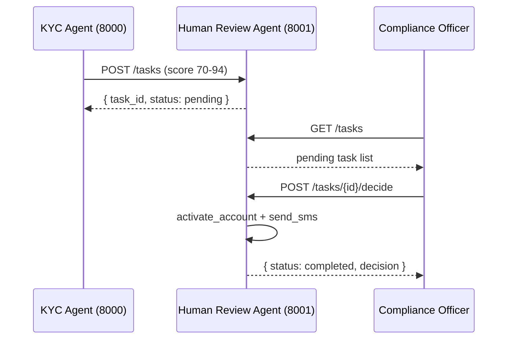
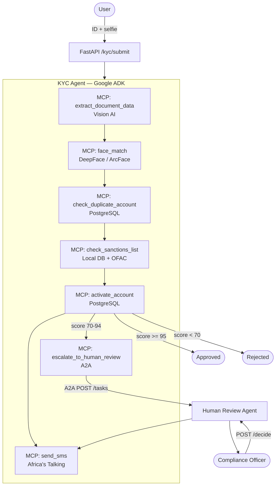

# Agentic AI Frameworks in Practice — KYC Demo

> A hands-on demonstration of **Google ADK**, **MCP**, and **A2A** working together
> on a real-world use case: automated KYC (Know Your Customer) verification .

Presented at **GDG Workshop — Frameworks Agentifs: ADK, A2A, MCP — May 16, 2026, Abidjan**.

---

## What This Project Demonstrates

Three agentic frameworks, each playing a distinct role:

| Framework | Role in this project |
|---|---|
| **Google ADK** | Orchestrates the agent — runs the LLM, decides which tool to call next, manages session state |
| **MCP (Model Context Protocol)** | Defines the tools the agent can use — each tool is a typed, callable function the LLM invokes by name |
| **A2A (Agent-to-Agent Protocol)** | Connects two independent agents — the KYC agent delegates ambiguous cases to a Human Review agent via a standard task API |

**The use case:** identity verification (KYC). A user submits an ID document and a selfie. An agent runs 6 checks autonomously, scores the submission, and either approves it, rejects it, or hands it off to a human reviewer — all without manual intervention.

The KYC domain was chosen because it is:
- Realistic enough to show meaningful tool chaining
- Complex enough to require A2A delegation (not every case is clear-cut)
- Familiar enough to follow without domain expertise

---

## The Three Frameworks

### Google ADK — Agent Orchestration

ADK provides the `LlmAgent` class that wraps the LLM and drives the tool-calling loop. You give it a model, an instruction, and a list of tools. It decides what to call, in what order, and when it is done.

```python
agent = LlmAgent(
    name="kyc_agent",
    model="ollama/gemma3:4b",          # or gemini/gemini-1.5-flash in prod
    instruction=KYC_AGENT_INSTRUCTION, # the prompt, including tool sequence rules
    tools=[
        FunctionTool(func=extract_document_data),
        FunctionTool(func=face_match),
        FunctionTool(func=check_duplicate_account),
        FunctionTool(func=check_sanctions_list),
        FunctionTool(func=activate_account),
        FunctionTool(func=escalate_to_human_review),
        FunctionTool(func=send_sms),
    ],
)
runner = InMemoryRunner(agent=agent)
```

The agent runs autonomously — it calls tools in sequence, reads their outputs, and produces a final decision. No hand-written routing logic.

---

### MCP — Typed Tool Functions

Each tool is a plain Python async function. MCP wraps it so the LLM can discover and call it by name with typed arguments.

Tools in this demo:

| Tool | What it does |
|---|---|
| `extract_document_data` | Parses a CNI or passport image using Vision AI, returns structured fields |
| `face_match` | Compares the selfie against the document photo using DeepFace / ArcFace |
| `check_duplicate_account` | Queries PostgreSQL for existing accounts with the same phone |
| `check_sanctions_list` | Fuzzy-matches the name against a local sanctions table + OFAC |
| `activate_account` | Writes the decision to the database and creates the account if approved |
| `escalate_to_human_review` | Sends the case to the Human Review Agent via A2A |
| `send_sms` | Notifies the applicant of the outcome |

Adding a new tool is four lines: create the function, export it, register it as a `FunctionTool`, mention it in the prompt.

---

### A2A — Agent-to-Agent Delegation

A2A is a protocol for agents to hand off tasks to other agents. Each agent publishes an **Agent Card** at `/.well-known/agent.json` that describes its capabilities and input schema. Other agents discover it and POST tasks to `/tasks`.

In this demo:



The two agents are fully independent services. They share no code except the database. The KYC agent does not know how the Human Review agent works internally — it only knows the task API.

---

## Architecture Overview



---

## Project Structure

```
kyc-agent/
├── main.py                         # FastAPI entry point
├── agent/
│   ├── kyc_agent.py                # ADK LlmAgent definition + InMemoryRunner
│   └── prompts.py                  # Agent instructions (tool sequence, scoring rubric)
├── tools/                          # MCP tools — one async function per file
│   ├── document_extractor.py       # Vision AI document parsing
│   ├── face_matcher.py             # DeepFace biometric comparison
│   ├── sanctions_checker.py        # Fuzzy sanctions screening
│   ├── duplicate_checker.py        # Duplicate account detection
│   ├── account_activator.py        # Account creation + audit log
│   ├── a2a_escalator.py            # A2A client — delegates to Human Review Agent
│   └── sms_sender.py               # Notifications
├── a2a/
│   └── human_review_agent.py       # Independent A2A agent (separate FastAPI service)
├── config/
│   └── settings.py                 # Env-driven configuration (Pydantic)
├── db/
│   ├── connection.py               # Async PostgreSQL pool
│   └── migrations/001_init.sql     # Schema: submissions, accounts, sanctions, audit
├── docker-compose.yml              # postgres + kyc-agent + human-review
├── Dockerfile
├── requirements.txt
└── .env.example
```

---

## Quick Start

### Prerequisites

- Docker and Docker Compose
- One of the two model backends below:

| Mode | What you need |
|---|---|
| **Local (default)** | Ollama installed + model pulled |
| **Prod** | A Gemini API key |

### 1. Clone and configure

```bash
git clone https://github.com/EtienneBel/kyc-agent.git
cd kyc-agent
cp .env.example .env
```

### 2a. Local mode — Ollama + Gemma (default)

**Install Ollama:**

- **macOS**: `brew install ollama` or download the app from [ollama.ai](https://ollama.ai)
- **Linux**: `curl -fsSL https://ollama.ai/install.sh | sh`
- **Windows**: download the installer from [ollama.ai](https://ollama.ai)

Then pull the model:

```bash
ollama pull gemma3:4b
```

Gemma runs entirely on your machine — nothing leaves your infrastructure.

Then set the Ollama URL in `.env` so Docker can reach it on the host machine:

```env
APP_ENV=local
OLLAMA_BASE_URL=http://host.docker.internal:11434
OLLAMA_MODEL=gemma3:4b
```

> **Why `host.docker.internal`?** Inside a Docker container, `localhost` refers to the container itself, not your machine. `host.docker.internal` is the hostname Docker provides to reach the host from within a container.

### 2b. Prod mode — Gemini

No local installation needed. Set in `.env`:

```env
APP_ENV=prod
GEMINI_API_KEY=your_gemini_api_key_here
```

### 3. Start all services

```bash
docker-compose up -d
```

Starts PostgreSQL (schema auto-applied), KYC Agent on `:8000`, Human Review Agent on `:8001`.

### 4. Submit a verification

```bash
curl -X POST http://localhost:8000/kyc/submit \
  -F "phone=+2250700000000" \
  -F "document_image=@/path/to/id.jpg" \
  -F "selfie=@/path/to/selfie.jpg"
```

Response:
```json
{
  "submission_id": "uuid",
  "status": "processed",
  "model_used": "ollama/gemma3:4b",
  "summary": "Résumé de la vérification..."
}
```

---

## API Reference

### KYC Agent — port 8000

| Method | Path | Description |
|---|---|---|
| GET | `/health` | Service health + active model |
| POST | `/kyc/submit` | Submit a verification request |
| GET | `/kyc/{submission_id}` | Get result and decision |

#### GET /health

```bash
curl http://localhost:8000/health
```

```json
{
  "status": "ok",
  "env": "local",
  "model": "ollama/gemma3:4b"
}
```

#### POST /kyc/submit

```bash
curl -X POST http://localhost:8000/kyc/submit \
  -F "phone=+2250700000000" \
  -F "document_image=@/path/to/id.jpg" \
  -F "selfie=@/path/to/selfie.jpg"
```

```json
{
  "submission_id": "a1b2c3d4-...",
  "status": "processed",
  "model_used": "ollama/gemma3:4b",
  "summary": "Vérification complète. Score: 97. Décision: approved."
}
```

#### GET /kyc/{submission_id}

```bash
curl http://localhost:8000/kyc/a1b2c3d4-...
```

```json
{
  "id": "a1b2c3d4-...",
  "phone": "+2250700000000",
  "first_name": "Kouassi",
  "last_name": "Bamba",
  "score": 97,
  "decision": "approved",
  "decision_reason": "All checks passed.",
  "created_at": "2026-05-23T10:00:00",
  "updated_at": "2026-05-23T10:00:45"
}
```

---

### Human Review Agent — port 8001 (A2A)

| Method | Path | Description |
|---|---|---|
| GET | `/health` | Service health |
| GET | `/.well-known/agent.json` | A2A Agent Card |
| POST | `/tasks` | Receive escalated case from KYC Agent |
| GET | `/tasks` | List pending reviews |
| GET | `/tasks/{task_id}` | Get task status |
| POST | `/tasks/{task_id}/decide` | Submit review decision |

#### GET /health

```bash
curl http://localhost:8001/health
```

```json
{ "status": "ok", "agent": "human-review-agent" }
```

#### GET /.well-known/agent.json

```bash
curl http://localhost:8001/.well-known/agent.json
```

```json
{
  "name": "human-review-agent",
  "description": "Handles KYC cases that require human review.",
  "version": "1.0.0",
  "url": "http://localhost:8001",
  "capabilities": ["kyc_review", "manual_approval", "manual_rejection"]
}
```

#### GET /tasks — list pending reviews

```bash
curl http://localhost:8001/tasks
```

```json
{
  "tasks": [
    {
      "task_id": "x9y8z7...",
      "status": "pending",
      "created_at": "2026-05-23T10:01:00",
      "payload": {
        "submission_id": "a1b2c3d4-...",
        "phone": "+2250700000000",
        "score": 82,
        "reason": "Face match confidence below threshold."
      }
    }
  ],
  "total": 1
}
```

#### GET /tasks/{task_id}

```bash
curl http://localhost:8001/tasks/x9y8z7...
```

```json
{
  "task_id": "x9y8z7...",
  "status": "pending",
  "created_at": "2026-05-23T10:01:00",
  "payload": { "submission_id": "a1b2c3d4-...", "score": 82 },
  "decision": null
}
```

#### POST /tasks/{task_id}/decide — submit review decision

```bash
curl -X POST http://localhost:8001/tasks/x9y8z7.../decide \
  -H "Content-Type: application/json" \
  -d '{
    "task_id": "x9y8z7...",
    "decision": "approved",
    "reviewer": "officer.diallo",
    "notes": "Document verified manually. Photo matches."
  }'
```

```json
{
  "task_id": "x9y8z7...",
  "status": "completed",
  "decision": "approved"
}
```

---

## Environment Variables

| Variable | Default | Description |
|---|---|---|
| `APP_ENV` | `local` | `local` (Gemma via Ollama) or `prod` (Gemini) |
| `GEMINI_API_KEY` | — | Required when `APP_ENV=prod` |
| `OLLAMA_BASE_URL` | `http://localhost:11434` | Ollama server URL |
| `OLLAMA_MODEL` | `gemma3:4b` | Ollama model name |
| `DB_HOST` | `localhost` | PostgreSQL host |
| `DB_PORT` | `5432` | PostgreSQL port |
| `DB_NAME` | `kyc_agent` | Database name |
| `DB_USER` | `kyc_user` | Database user |
| `DB_PASSWORD` | `kyc_secret` | Database password |
| `KYC_AUTO_APPROVE_THRESHOLD` | `95` | Score threshold for auto-approval |
| `KYC_AUTO_REJECT_THRESHOLD` | `70` | Score threshold for auto-rejection |
| `FACE_MATCH_MIN_CONFIDENCE` | `85.0` | Minimum face match confidence (%) |
| `SMS_PROVIDER` | `mock` | `mock` or `africastalking` |
| `AFRICASTALKING_USERNAME` | — | Africa's Talking username |
| `AFRICASTALKING_API_KEY` | — | Africa's Talking API key |
| `HUMAN_REVIEW_AGENT_URL` | `http://localhost:8001` | A2A Human Review Agent URL |

---

## Development Notes

### Adding a new MCP tool

1. Create `tools/my_tool.py` with an async function
2. Export it from `tools/__init__.py`
3. Register it in `agent/kyc_agent.py` as `FunctionTool(func=my_tool)`
4. Reference it in `agent/prompts.py` if it belongs in the mandatory sequence

### Model switching

`APP_ENV=local` routes to Gemma 3:4B via Ollama — fully on-premise, no data leaves the machine. `APP_ENV=prod` routes to Gemini 1.5 Flash. LiteLLM handles the routing; switching models requires only an env change.

### Auto-escalation safety net

Smaller models (like `gemma3:4b`) occasionally drop mid-sequence tool calls. After the agent finishes, `_ensure_escalated_if_pending()` checks if the submission is still in `pending_review` with no score and triggers A2A escalation automatically. This is a practical pattern for production agentic systems using smaller models.

---

## License

MIT

---

*GDG Workshop — Frameworks Agentifs: ADK, A2A, MCP — May 16, 2026, Abidjan, Côte d'Ivoire*
*Built by [@EtienneBel](https://github.com/EtienneBel)*
